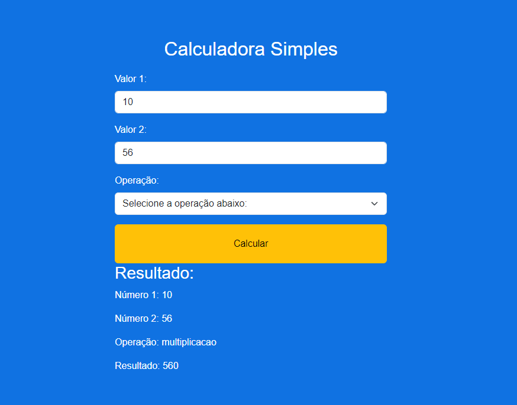
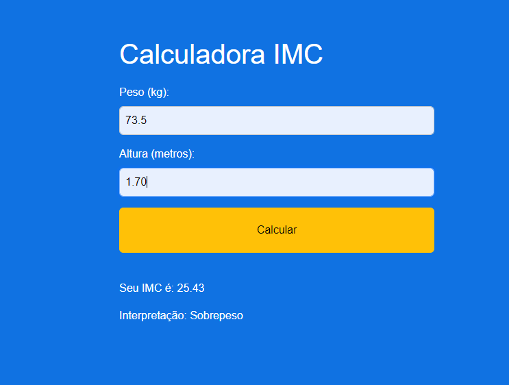

# Projeto de Estudo: Calculadoras em PHP

Este projeto contém duas calculadoras desenvolvidas como parte de um estudo em PHP: uma calculadora simples e uma calculadora de IMC (Índice de Massa Corporal). A calculadora de IMC foi criada utilizando PHP e Bootstrap para uma melhor apresentação.

## Capturas de Tela

### Calculadora


Descrição: Esta é a interface da calculadora simples. Ela permite realizar operações matemáticas básicas como adição, subtração, multiplicação e divisão.

### Calculadora de IMC


Descrição: A calculadora de IMC permite calcular o Índice de Massa Corporal com base no peso e na altura fornecidos pelo usuário. Esta calculadora foi desenvolvida usando PHP e estilizada com Bootstrap para uma interface mais amigável.

## Descrição do Projeto

Este projeto foi desenvolvido com o objetivo de praticar e aprimorar habilidades em PHP e na integração com Bootstrap. Ele inclui:

- Uma calculadora simples para operações matemáticas básicas.
- Uma calculadora de IMC que calcula e classifica o índice de massa corporal do usuário.

## Tecnologias Utilizadas

- **PHP**: Linguagem de programação usada para desenvolver a lógica das calculadoras.
- **Bootstrap**: Framework CSS utilizado para estilizar a calculadora de IMC.

## Como Usar

1. Clone o repositório para a sua máquina local:
    ```bash
    git clone https://github.com/usuario/projeto-calculadoras-php.git
    cd projeto-calculadoras-php
    ```

2. Certifique-se de ter um servidor web com suporte para PHP (por exemplo, XAMPP, WAMP, ou MAMP).

3. Coloque os arquivos do projeto na pasta raiz do seu servidor web.

4. Acesse os arquivos através do seu navegador:
    - Calculadora Simples: `http://localhost/pasta_do_projeto/calculadora.php`
    - Calculadora de IMC: `http://localhost/pasta_do_projeto/calculadoraIMC.php`

## Estrutura do Projeto

- `calculadora.php`: Arquivo PHP para a calculadora simples.
- `calculadoraIMC.php`: Arquivo PHP para a calculadora de IMC.
- `css/`: Pasta contendo arquivos de estilo CSS, incluindo Bootstrap.
- `img/`: Pasta contendo as imagens usadas no README.

## Contribuição

Contribuições são bem-vindas! Sinta-se à vontade para enviar pull requests com melhorias ou sugestões.

## Licença

Este projeto está licenciado sob a MIT License. Consulte o arquivo `LICENSE` para mais informações.

---

Desenvolvido como parte de um estudo em PHP e Bootstrap.
